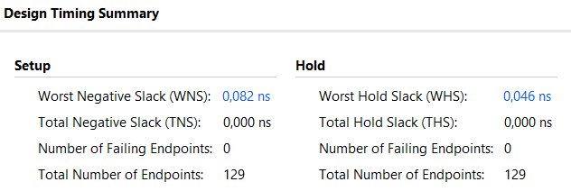
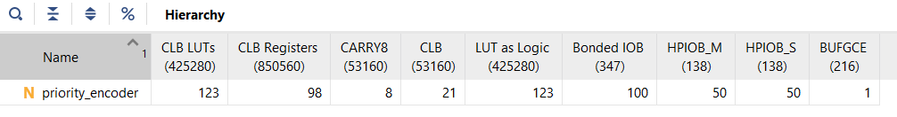
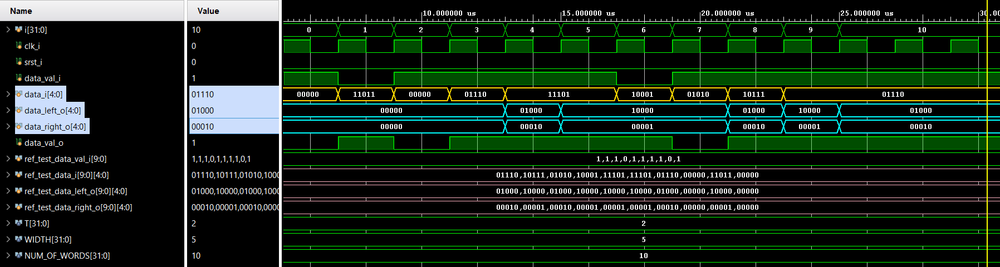

### This repository contains an implementation of a simple priority encoder (code in SystemVerilog, reference model in Matlab).

>The design was synthesized and implemented, followed by timing analysis (900 _MHz_ frequency for _Zynq _UltraScale+ RFSoCs (xczu48dr-fsvg1517-2-e_)) and resource usage analysis (_Figure 1 and 2, respectively_).

>The module test results for a bit depth of 5 (for clarity) are shown in _Figure 3_.

Fig.1. Timing analys

Fig.2. Utilization report

Fig.3. TestBench result
